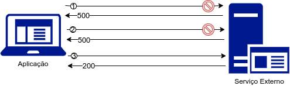
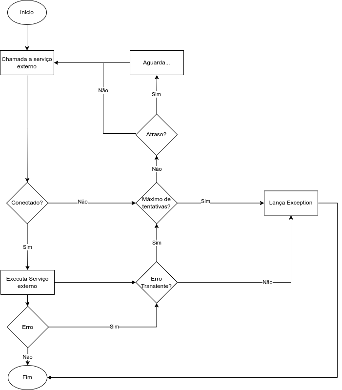

# Utilizando o padrão Retry na chamada de APIs REST utilizando a biblioteca Resilience4J

Antes de detalhar o patterns Retry, é importante entender como as falhas podem ser classificadas:

* *Transientes:* Ocorrem uma vez e desaparecem com curta duração. Se você repetir a operação é provável que terá sucesso.
* *Intermitentes:* Falhas transientes que ocorrem repetidamente. Elas acontecem e desaparecem por “vontade própria”.
* *Permanentes:* São as falhas que permanecerão até que alguma ação seja tomada como, por exemplo, trocar um equipamento ou corrigir o software

Quando falamos de sistemas distribuídos, não temos ideia de como e quando os componentes podem falhar. Essas falhas podem variar desde problemas de rede, erros internos relacionados com design, codificação, enfim, uma grande infinidade de problemas. 

O padrão de projeto Retry tem como objetivo permitir que uma aplicação trate falhas transientes que ocorrem durante o consumo de serviços externos. Sua utilização torna nossa aplicação resiliente ao fazer, automaticamente, novas tentativas de chamada em caso de falha durante o consumo do serviço externo.

## Pré-requisitos

Considere um cenário onde uma aplicação se comunica com muitos elementos externos, e tem que ser suscetível à falhas transitórias que podem ocorrer nesse ambiente. As falhas incluem perda momentânea de conectividade de rede , indisponibilidade temporária ou timeouts que surgem quando o serviço externo está ocupado.

Essas falhas geralmente são autocorretivas e se a ação que resultou em falha for repetida após um período de tempo, é provável que seja bem-sucedida. Por exemplo:

Imagine que um serviço externo a sua aplicação está processando um grande número de solicitações simultâneas. Esse serviço pode implementar uma estratégia de limitação que rejeita temporariamente quaisquer solicitações adicionais até que sua carga de trabalho tenha diminuído. Durante este período de indisponibilidade, sua aplicação pode não conseguir acessar o serviço externo sobrecarregado, mas se ela tentar novamente após um período de tempo, talvez tenha êxito.

Um ponto importante no exemplo acima é que ao tornar nossa aplicação resiliente, o usuário final talvez nem tenha percebido que houve falhas nas tentativas de comunicação. Ele fez uma requisição e teve seu resultado. Com isso, podemos dizer que melhoramos a experiência do usuário.

**Quando utilizar?**
* Cenários onde uma aplicação pode apresentar falhas transitórias ao interagir com serviços/recursos externos.

**Quando não utilizar?**
* Tratamento de falhas de longa duração, pois pode afetar o tempo de resposta da aplicação.
* Tratamento de falhas não transitórias, exemplo: exceções internas causadas por erros de lógica ou codificação.
* Tratamento de problemas de escalabilidade do sistema.

## Arquitetura

A ideia básica da arquitetura por trás do padrão retry é muito simples. Basicamente envolvemos a chamada da função protegida em um objeto retry que monitora as falhas. Uma vez que falhas transientes começarem a ocorrer, a aplicação poderá lidar com a falha usando uma das seguintes estratégias:

* **Cancelar:** Quando a falha aparenta não ser transitória ou se for repetida, provavelmente não será bem-sucedida, a aplicação deve cancelar a operação e relatar uma exceção. Por   	exemplo, uma falha de autenticação causada pelo fornecimento de credenciais inválidas provavelmente não será bem-sucedida, independentemente de quantas tentativas ocorram.
* **Tentar Novamente:** Se a falha específica relatada é incomum. Nesse caso, a aplicação pode repetir a solicitação com falha imediatamente porque é improvável que a mesma falha se repita e a solicitação provavelmente será bem-sucedida 
* **Tentar novamente após um período de tempo:** Se a falha é causada por uma ou mais falhas comuns, a rede ou o serviço externo podem precisar de um breve período enquanto os problemas são corrigidos. A aplicação deve esperar por um período de tempo adequado antes de tentar executar novamente a solicitação.

Sempre que formos fazer uma implementação utilizando o padrão “Retry” devemos definir os seguintes pontos:

1 Identificar os erros transitórios:
Devemos identificar se o erro é transitório ou não. Isso permitirá decidir se a solicitação precisa ser repetida, ou se o erro deve ser registrado. Por exemplo, um tempo limite de conexão indica um erro de rede e deve ser repetido. Por outro lado, uma falha de autenticação não desaparece após alguns segundos e não deve ser repetida.

2 Tempo de retentativa: 
Para tarefas “real time”, como solicitação de página da Web, o atraso deve ser o mais curto possível, e as novas tentativas devem ser menores. Nesse cenário, os erros podem fornecer uma experiência melhor do que as novas tentativas atrasadas. No entanto, para tarefas de execução longa ou em segundo plano, como enviar uma notificação por e-mail, o atraso deve ser longo o suficiente para permitir a recuperação do sistema.
Temos três maneiras de definir o tempo para a retentativa:

* **Tempo constante:** O tempo é o mesmo para todas as tentativas. Isso é bom para falhas de rede ou serviços de baixa carga.

* **Tempo incremental:** O tempo é calculado com base no número de tentativas decorridas. Alguns exemplos de tempo incremental são: linear, exponencial e fibonacci. Exponencial é o mais comum em que o tempo dobra toda vez que a solicitação repetida falha.

* **Tempo randômico:** O tempo é calculado aleatoriamente entre um valor mínimo e máximo, ou através de uma função mais complexa que garante a produção de atrasos aleatórios. Isso é útil para evitar problemas caso um grande número de solicitações ocorram ao mesmo tempo, e todas essas solicitações falharem. Se formos retentar novamente ao mesmo tempo, criaremos outro problema. A aleatoriedade nos atrasos de repetição evitará isso ocorra.

3 Garantir idempotência do serviço que será encapsulado na estratégia de retry:
Idempotência é uma característica da operação onde ela pode ser executada repetidas vezes sem causar nenhum efeito colateral.
Ao se deparar com requisições duplicadas, um serviço precisa estar preparado para reconhecer a situação e trabalhar de forma a não ficar inconsistente.

Uma implementação simples do padrão de projeto Retry consiste nos seguintes passos:

* Identifique as condições transitórias, por exemplo, quais códigos de resposta, erros ou exceções de rede indicam um erro transitório;
* Decida o tempo de retentativa;
* Decida o número máximo de retentativas.
* Enquanto a contagem de novas tentativas for menor que a contagem máxima, repita a solicitação até que ela seja bem-sucedida;
* Se as novas tentativas se esgotarem, registre o erro e interrompa a solicitação.

Os cinco passos citados acima devem ser combinados para criar a política de “Retry” que se ajuste às necessidades de sua demanda, exemplo:

Um ponto importante, é que a implementação da lógica de retentativa deve considerar o compreendimento total do contexto de uma operação com falha. Por exemplo, se uma aplicação que contém uma política de repetição invocar outro serviço que também contém uma política de repetição, essa camada extra de repetições pode adicionar atrasos longos no tempo total de execução da aplicação.

## Visão geral do cenário de teste

## Código Fonte
Abaixo, segue o exemplo implementado:

* [Código fonte do exemplo](https://github.com/andrepreis/Resilience4J-Demo/tree/main/Projects_Demo/r4j-retry)

## Executando o Exemplo

Primeiramente clone o repositório:

> git clone https://github.com/andrepreis/Resilience4J-Demo.git

Para executar o exemplo, você precisará compilar e empacotar as seguintes aplicações:
	
* *superapi* : Aplicação que contem os serviços fake que simulam servições externos que tem sua chamada encapsulada dentro do circuit breaker.
* *r4j-retry* : Aplicação que implementa o *padrão Retry* que controla as chamadas para o suposto serviço externo

Para execução dos exemplos você pode utilizar sua IDE favorita(Eclipse, VSCode, IntelliJ), ou compilar e executar as aplicações via linha de comando.
No meu caso em específico, utilizo a  IDE Eclipse juntamente com o plugin do SpringBoot, onde todas as aplicações springboot são detectadas e consigo inicia-las de dentro da IDE.
