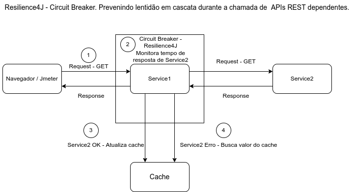
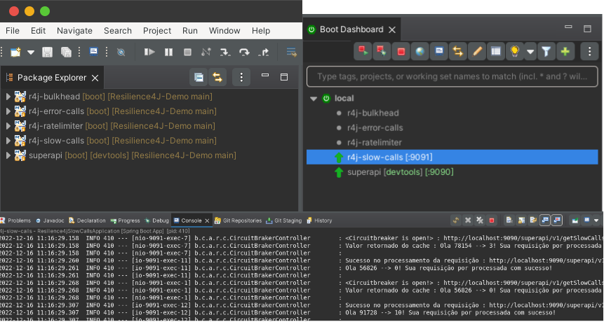
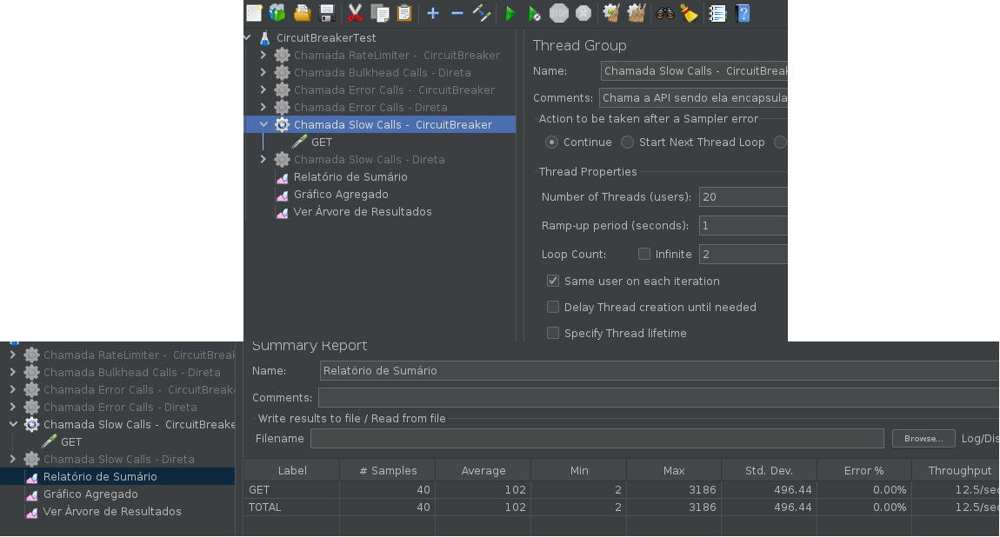

# Prevenindo lentidão em cascata na chamada de APIs REST utilizando o padrão Circuit Breaker com a biblioteca Resilience4J

Neste exemplo, iremos aprender como evitar lentidão em cascata nas chamadas entre APIs REST usando o módulo  *Circuit Breaker* do Resilience4j .
Imagine que temos dois serviços: *Service1* e *Service2* .  *Service1* depende de execução e resposta de *Service2* para prosseguir com seu processamento.
Por algum motivo, *Service2* está apresentando lentidão. Em vez de chamar repetidamente por *Service2*, *Service1* deve parar momentaneamente de chama-lo até que o *Service2* esteja completamente ou parcialmente recuperado.

Utilizando a biblioteca Resilience4j, essa funcionalidade pode ser facilmente obtida com o uso da anotação @CircuitBreaker 

## Visão geral do cenário 

* Os usuários fazem chamadas para obter uma resposta de *Service1*.
* *Service1* faz chamadas para *Service2* e aguarda resposta.
* O tempo de resposta normal de *Service2* é de ~20 ms. Devido a algum problema aleatório, 50% das chamadas para *Service2* levam mais de 3 segundos.
* Esse comportamento de lentidão de *Service2* não deve afetar *Service1* .
* Sempre que *Service1* perceber que 50% das chamadas estão demorando mais de 20 ms, ele não chamará *Service2* e retornará a resposta armazenada, por exemplo, em um cahce.

Todas essas funcionalidades citadas acima, podem ser obtidas com o uso do padrão *Circuit Breaker*.

## Código Fonte
Abaixo, segue o exemplo implementado:

* [Código fonte do exemplo](https://github.com/andrepreis/Resilience4J-Demo/tree/main/Projects_Demo/resilience4j-slow-calls)

## Arquitetura

A arquitetura acima demonstra um modelo  básico de aplicação onde iremos simular lentidão na chamada de algum serviço externo:

1. Varias threads são disparadas via JMeter ou navegador tendo como alvo *Service1*.
2. *Service1* esta encapsulando dentro de um *circuit breaker* todas as chamadas que são realizadas para o serviço externo *Service2* . 
3. Este *circuit breaker* monitora todas as chamadas para *Service2* originadas a partir de *Service1*.
4. Sempre que *Service2* responder de forma adequada, *Service1* retorna a resposta para o solicitante e atualiza o cache da aplicação.
5. Sempre que ocorrer algum tipo lentidão anormal na chamada de *Service2*, o circuito sera aberto e *Service1* retornará o valor mais atual existente no cache.

## Executando o Exemplo

Para executar o exemplo, você precisará compilar e empacotar as seguintes aplicações:
	
* *superapi* : Aplicação que contem os serviços fake que simulam servições externos que tem sua chamada encapsulada dentro do circuit breaker.
* *resilience4j-slow-calls* : Aplicação que implementa o *circuit breaker* que controla lentidão na chamada ao serviço externo *Service2*.

Para execução dos exemplos você pode utilizar sua IDE favorita(Eclipse, VSCode, IntelliJ), ou compilar e executar as aplicações via linha de comando.
No meu caso em específico, utilizo a  IDE Eclipse juntamente com o plugin do SpringBoot, onde todas as aplicações springboot são detectadas e consigo inicia-las de dentro da IDE.

Se preferir executar os exemplos via linha de comando, siga os passos de 1 a 5 que estão definidos a seguir:

1. Devemos compilar e empacotar a API que irá simular os problemas. Acesse o diretório "Resilience4J-Demo/Projects_Demo/superapi":

	 > xxxxxxx@aaa-aaaa:~/eclipse-workspace/Resilience4J-Demo/Projects_Demo/superapi$ **mvn clean install**

2. Dentro do diretório "Resilience4J-Demo/Projects_Demo/superapi/target" inicie a aplicação "superapi-1.0-SNAPSHOT.jar":
	
	>	xxxxxxx@aaa-aaaa:~/eclipse-workspace/Resilience4J-Demo/Projects_Demo/superapi/target$ **java -jar superapi-1.0-SNAPSHOT.jar** 

3. Dentro do diretório "Resilience4J-Demo/Projects_Demo/resilience4j-slow-calls" precisamos compilar e empacotar o projeto que encapsula as chamadas para o serviço externo *Service2*.

	 > xxxxxxx@aaa-aaaa:~/eclipse-workspace/Resilience4J-Demo/Projects_Demo/resilience4j-slow-calls$ **mvn clean install**

4. Dentro do diretório "Resilience4J-Demo/Projects_Demo/resilience4j-slow-calls/targe" inicie a aplicação "r4j-slow-calls-0.0.1-SNAPSHOT.jar" :
	
	>	xxxxxxx@aaa-aaaa:~/eclipse-workspace/Resilience4J-Demo/Projects_Demo/resilience4j-slow-calls/target$ **java -jar r4j-slow-calls-0.0.1-SNAPSHOT.jar**
	
5. Com as duas aplicações sendo executadas, teremos dois endpoints:

	* http://localhost:9090/superapi/v1/getSlowCalls : Endpoint da APIs que irá gerar lentidão aleatória e será utilizada para testarmos a implementação de circuit breaker
	
	* http://localhost:9091/superapi/v1/getSlowCalls : Endpoint que encapsula a chamada para a API acima dentro de um circuit breaker.
	
6. Para visualizarmos melhor o atuação do *circuit breaker* quando a API monitorada começa a apresentar lentidão, utilizaremos o *JMeter*. 
   O *JMeter* faz simulação de várias chamadas simultâneas a *Service1* e este, por sua vez, faz chamadas para *Service2*. 
   *Service2* por um motivo qualquer começa a apresentar lentidão no processamento, o que pode afetar diretamente *Service1*. 
   Você pode baixar o scrip JMeter clicando no link : [Resilience4J.jmx](../../Resilience4J.jmx).
   Confira nos tópicos posteriores maiores detalhes.

7. Com o sript de testes devidamente importado no Jmeter, vamos verificar dois cenários:

	1. Iremos chamar  diretamente *Service2* e observar o comportamento quando ocorrer lentidão durante sua chamada;
			
	Disparamos 2 ciclos de 20 requisições dentro de um intervalo de 2 segundos e obtemos um tempo médio de processamento de 1278ms por requisição.
	
	2. Iremos chamar *Service1* e este por sua vez, fara chamadas para *Service2*. Detalhe, a chamada para *Service2* esta encapsulada dentro por um *circuit breaker*.
	
	Disparamos 2 ciclos de 20 requisições dentro de um intervalo de 2 segundos e obtemos um tempo médio de processamento de 100ms por requisição.
	
8. Após a execução dos dois cenários, iremos  comparar o resultado das duas execuções:
Note que quando encapsulamos as chamadas para *Service2* dentro do *circuit breaker*, o tempo médio de resposta de *Service2* foi significativamente menor quando comparado com a chamada direta sem o *circuit breaker*. 
Porque isso acontece?
Isso ocorre porque definimos a seguinte condição em nosso *circuit breaker* :
	* Chamadas com duração superior a 50ms são consideradas *chamadas lentas*.
	* Quando 50% das chamadas tem tempo de resposta superior a 50ms, o *circuit breaker* endende que *Service2*  esta passando por problemas. 
	  Com este indicativo, o *circuit breaker* será aberto, e *service1* retornará o valor mais atual do cache não efetuando a chamada para *service2*. 
	  Assim, *Service1* não precisa esperar a resposta de *Service2* e retorna o valor diretamente o cache. 
	 

## Detalhes do Código

Para encapsular a chamada para um serviço externo, basta colocar a anotação *@CircuitBreaker* no método que faz a chamada para o serviço externo:

> @CircuitBreaker(name = "circuitSlowMonitor", fallbackMethod = "fallBack")

O parâmetro *name* se refere ao nome do *circuit breaker*.

O parâmetro *fallbackMethod* se refere ao método que será chamado quando o *circuit breaker* estiver com status aberto. 

Nosso *circuit breaker* é configurado no arquivo *application.yml*, confira:

>
> resilience4j:
>
>     circuitbreaker:
>
>         configs:
>
>             default:
>
>                 slidingWindowSize: 10
>
>                 slidingWindowType: COUNT_BASED
>
>                 minimumNumberOfCalls: 5
>
>                 permittedNumberOfCallsInHalfOpenState: 3
>
>                 automaticTransitionFromOpenToHalfOpenEnabled: true
>
>                 waitDurationInOpenState: 5s
>
>         instances:
>
>             circuitSlowMonitor:
>
>                 baseConfig: default
>
>                 slowCallRateThreshold: 50
>
>                 slowCallDurationThreshold: 10ms

Confira a abaixo uma breve descrição dos principais parâmetros utilizados na configuração de nosso *circuit breaker*.

* *minimumNumberOfCalls*: Configura o número mínimo de chamadas necessárias (por período da janela deslizante) antes que o *circuit breaker* possa calcular a taxa de erro. Por exemplo, se esta propriedade for 10, pelo menos 10 chamadas deverão ser registradas antes que a taxa de falha possa ser calculada. Se apenas 9 chamadas tiverem sido gravadas, o *circuit breaker* não fará a transição para ABERTO, mesmo que todas as 9 tenham falhado.
* *slidingWindowSize*: Configura a quantidade de últimos registros armazenados no estado FECHADO para realizar o cálculo de taxa de falha. Por exemplo, *Service1* já executou 50 chamadas para *Service2* no estado FECHADO, se esta propriedade estiver com valor 10, serão consideradas as 10 últimas interações para calcular a taxa de falha (failureRateThreshold). 
* *failureRateThreshold*: P a porcentagem de limite de erros necessário para o Circuit breaker alterar seu estado para ABERTO, neste caso, está em 50%, ou seja, de um total de 10 tentativas, se 5 falharem o algoritmo irá parar de chamar o *Service2* e retornará uma mensagem tratada ou executará o retorno personalizado mencionado anteriormente.
* *waitDurationInOpenState*: O tempo que deve esperar antes de fazer a transição de ABERTO para ENTREABERTO.
* *permittedNumberOfCallsInHalfOpenState*: Configura o número de chamadas necessárias para calcular a taxa de falha novamente quando o Circuit Breaker estiver com estado ENTREABERTO.
* *eventConsumerBufferSize*: Define a quantidade de mensagens que irão aparecer nos eventos do *circuit breaker* dentro do *Actuator*.
* *recordExceptions*: Uma lista de exceções que serão contabilizadas como falha. Qualquer exceção correspondente ou herdada de uma das listas conta como uma falha, a menos que seja explicitamente ignorada via ignoreExceptions. Por padrão, todas as exceções são registradas como falhas.
* *slowCallRateThreshold*: O *circuit breaker* considera uma chamada lenta quando n% das chamadas tem duração maior que *slowCallDurationThreshold*.
* *slowCallDurationThreshold*: Configura o limite de duração acima do qual as chamadas são consideradas lentas.

