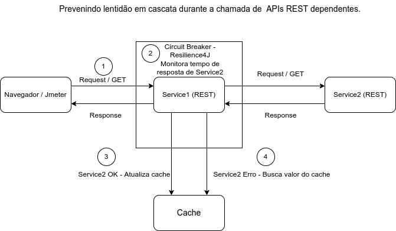

# Prevenindo lentidão em cascata na chamada de APIs REST utilizando o padrão Circuit Breaker com a biblioteca Resilience4J

Neste demo, aprenderemos como evitar lentidão em cascata entre APIs REST usando o módulo  Circuit Breaker do Resilience4j .
Imagine que temos dois serviços: *Service1* e *Service2* .  *Service1* depende de execução e resposta de *Service2* para prosseguir com seu processamento.

Por algum motivo, *Service2* está apresentando lentidão. Em vez de chamar repetidamente por *Service2*, *Service1* deve parar momentaneamente de chama-lo até que o *Service2* esteja completamente ou parcialmente recuperado.
Utilizando a biblioteca Resilience4j, essa funcionalidade pode ser facilmente obtida com o uso da anotação @CircuitBreaker.

## Visão geral

* Os usuários fazem chamadas para obter uma mensagem  de Service1.
* *Service1* chama *Service2* para buscar a mensagem.
* O tempo de resposta normal de *Service2* é de ~20 milissegundos. Devido a algum problema aleatório, 50% das chamadas para *Service2* levam mais de 4 segundos.
* Esse comportamento de lentidão de *Service2* não deve afetar *Service1* .
* Sempre que  *Service1* perceber que 50% das chamadas estão demorando mais de 20 milissegundos, ele não chamará *Service2* e retornará a resposta armazenada, por exemplo, em um cahce..

Todas essas funcionalidades citadas acima, podem ser obtidas com o uso do padrão *Circuit Breaker*.

## Código Fonte

[Código fonte do exemplo](https://github.com/andrepreis/Resilience4J-Demo)

## Arquitetura

A arquitetura acima descreve o modelo da aplicação criada:

1. Varias threads são disparadas via JMeter ou navegador chamando Service1.
2. Service1 esta encapsulado por um objeto Circuit Breaker. Este circuit breaker monitora todas as chamadas para Service2 originadas a partir de Service1.
3. Sempre que Service2 responder de forma adequada, Service1 retorna a resposta para o solicitante e atualiza o cache da aplicação.
4. Sempre que ocorrer lentidão em Service2, o circuito sera aberto e Service1 retornará o valor mais atual existente no cache.

## Executando o Exemplo

## Detalhes do Código
